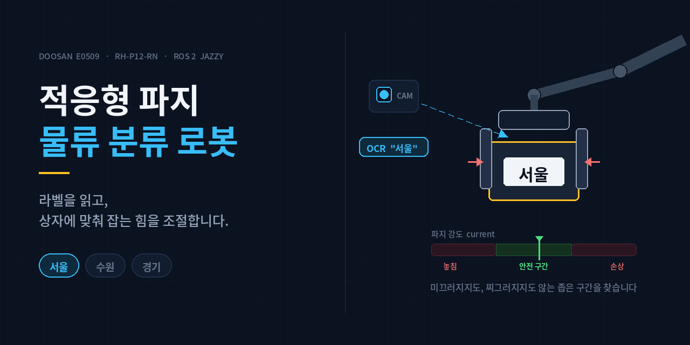
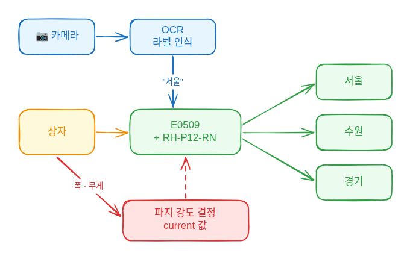

# 두산 E0509 협동로봇을 이용한 OCR 기반 적응형 파지 물류 분류 시스템

두산 **E0509** 로봇팔과 **RH-P12-RN(A)** 그리퍼로, 상자에 붙은 라벨(**서울 / 수원 / 경기**)을
카메라로 읽고 해당 목적지로 옮기는 물류 분류 시스템입니다.
상자의 크기·무게에 맞춰 **파지 강도를 스스로 조절**하는 것이 이 프로젝트의 핵심입니다.

## 시연 영상

[](https://www.youtube.com/watch?v=qVYhtreRa00)

> 위 이미지를 클릭하면 유튜브에서 시연 영상을 볼 수 있습니다.



> 다이어그램 원본: [`docs/architecture.excalidraw`](docs/architecture.excalidraw)

> **현재 상태**: 로봇 연결 확인 단계입니다.
> 각 팀이 자기 폴더에서 작업한 뒤 나중에 합칠 예정이라, 아직 공용 코드는 없습니다.

## 시작하기

**[→ 설치 및 실행 가이드 (docs/RUN.md)](docs/RUN.md)**

처음 합류했다면 이 문서를 위에서부터 따라 하세요.
설치, 로봇 연결, 그리퍼 제어, 주피터 실행, 자주 겪는 문제가 다 들어 있습니다.

두산 드라이버와 그리퍼 패키지가 **저장소에 함께 들어 있어서**, 받아서 빌드만 하면 됩니다.
따로 clone 하거나 패치할 필요 없습니다. (대신 clone 이 좀 느립니다 — 약 400MB)

```bash
git clone https://github.com/robot-e0509/box-sorter.git doosan_ws
cd doosan_ws && colcon build --symlink-install && source install/setup.bash
```

## 저장소 구조

```
doosan_ws/
├── docs/
│   ├── RUN.md                    설치 · 실행 · 트러블슈팅
│   └── architecture.excalidraw   시스템 구조 다이어그램
├── notebooks/
│   └── 00_robot_connect.ipynb    로봇 연결 · 좌표 확인
└── src/
    ├── doosan-robot2/            [외부] 두산 공식 ROS2 드라이버
    │                             DSR_ROBOT2.py 패치 적용됨 — 건드리지 마세요
    ├── dsr_study/                [외부] RH-P12-RN 그리퍼 서비스
    │
    └── (여기에 각 팀 폴더를 만듭니다)
```

## 프로젝트 목표

| 단계 | 내용 |
|------|------|
| **1단계** | 우리가 만든 상자(**크기·무게 고정**)를 대상으로, 파지 강도를 하드코딩해서 확실히 동작시킨다 |
| **2단계** | 어느 크기/무게까지 가능한지 실험으로 알아내고, 상자에 맞춰 **강도를 동적으로 계산**하도록 확장한다 |

1단계에서 찾아낸 "되는 숫자"가 2단계의 출발점입니다.
그래서 파지 실험값(폭 / 무게 / 안 미끄러지는 최소 `current`)은 반드시 기록해 공유합니다.

파지 강도는 그리퍼의 `current`(전류 제한) 값으로 줍니다. **전류 기반 위치 제어**라서
물체를 만나면 그 힘으로 잡고 멈추는데, 이 값이 너무 낮으면 상자를 놓치고 너무 높으면
찌그러뜨립니다. **그 사이의 좁은 구간을 찾아내는 것**이 이 프로젝트가 푸는 문제입니다.

## 팀 구성

| 팀 | 담당자 | 맡은 것 |
|----|--------|---------|
| **OCR** | 엄요한, 이광희 | 카메라 이미지에서 라벨(서울/수원/경기) 읽기 |
| **고정 강도 파지** | 조성래, 윤정우 | 고정 크기 상자 · 파지 강도 하드코딩 |
| **동적 강도 파지** | 송다현, 정수진 | 상자 폭·무게에 따라 파지 강도 계산 |

**로봇은 한 명씩 씁니다.** 두 명이 동시에 명령을 보내면 섞여서 위험합니다.
자세한 안전 수칙은 [RUN.md](docs/RUN.md#안전) 참고.

## 커밋하면 안 되는 것

`.gitignore` 가 막아주지만 `git status` 로 한 번 더 확인하세요.

- `build/`, `install/`, `log/` — 빌드 산출물 (1.1GB. `colcon build` 로 다시 만들어집니다)
- 사진·영상 원본 — 용량이 큽니다. 구글 드라이브에 올리고 링크만 공유하세요.
- `src/doosan-robot2/`, `src/dsr_study/` — 외부 패키지. 저장소에 들어 있지만
  **우리가 고칠 일은 없습니다.** 여기를 수정한 커밋이 올라오면 리뷰에서 막아주세요.
